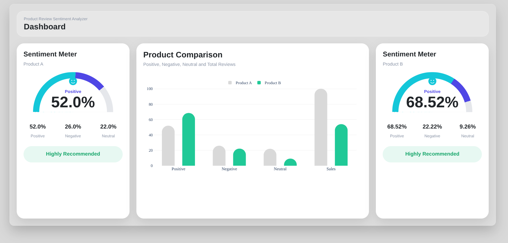

# Product Review Sentiment Analysis System

A web application that analyzes customer reviews from Daraz products using a transformer-based sentiment analysis model. The system retrieves reviews automatically, classifies customer sentiment, and presents the results through an interactive dashboard with visual analytics and product comparison.

## Preview

> Screenshots will be added here.

| Home | Dashboard |
|------|-----------|
|  |  |

---

## Features

- Analyze reviews directly from a Daraz product URL
- Compare two products side by side
- Automatic review extraction
- Positive, Neutral and Negative sentiment classification
- Interactive dashboard with charts
- Overall product recommendation
- Sample positive and negative reviews
- Responsive interface

---

## Technology Stack

| Category | Technologies |
|----------|--------------|
| Backend | Django, Python |
| Frontend | HTML, CSS, Bootstrap, JavaScript |
| NLP | Hugging Face Transformers, PyTorch |
| Data Collection | Requests, BeautifulSoup |
| Visualization | Plotly |

---

## Project Workflow

```
                 Product URL
                      │
                      ▼
            Extract Product ID
                      │
                      ▼
             Retrieve Reviews
                      │
                      ▼
           Text Preprocessing
                      │
                      ▼
     Transformer Sentiment Model
                      │
                      ▼
         Sentiment Classification
                      │
                      ▼
      Dashboard & Product Comparison
```

---

## Installation

Clone the repository.

```bash
git clone https://github.com/MoktanSujita/Product-Review-Sentiment-Analysis-System.git
```

Move into the project directory.

```bash
cd Product-Review-Sentiment-Analysis-System
```

Create a virtual environment.

```bash
python -m venv venv
```

Activate it.

Windows

```bash
venv\Scripts\activate
```

Linux/macOS

```bash
source venv/bin/activate
```

Install the dependencies.

```bash
pip install -r requirements.txt
```

Run the server.

```bash
python manage.py runserver
```

Open

```
http://127.0.0.1:8000/
```

---

## Repository Structure

```
Product-Review-Sentiment-Analysis-System
│
├── analyzer/
├── static/
├── templates/
├── media/
├── manage.py
├── requirements.txt
└── README.md
```

---

## Challenges

- Handling multilingual and romanized Nepali reviews
- Retrieving reviews from dynamically generated product pages
- Selecting an appropriate multilingual sentiment model
- Presenting analytical results in an intuitive dashboard

---

## Future Work

- Support additional e-commerce platforms
- Aspect-based sentiment analysis
- Review summarization
- User authentication
- Report export
- REST API

---

## License

This project is licensed under the MIT License.
